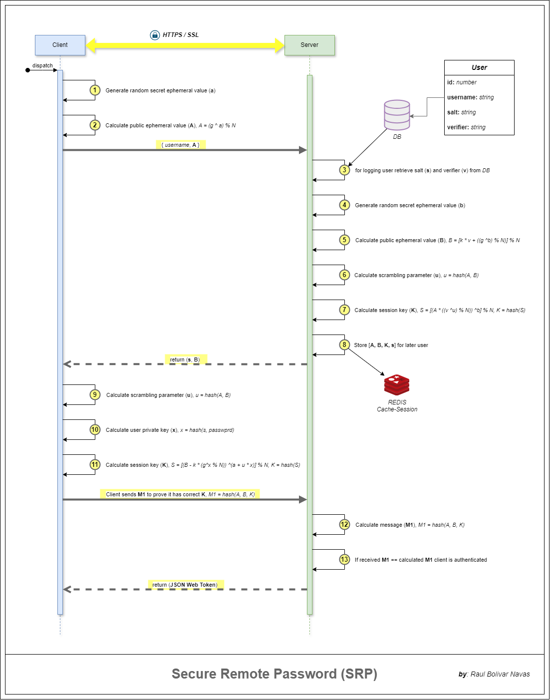

# srp-core

Librería Java estándar para autenticación segura usando **SRP-6a** (Secure Remote Password).

#### Flow of authentication:

#### Include:
- SRPInteger (wrapper de BigInteger)
- SRPUtils (hashes, pruebas, cálculo de `u`, `M1`, `M2`, etc.)
- SrpServerSession
- SRPConstants (`N`, `g`, `k`)

#### Author: [Raul Bolivar Navas](https://github.com/raulrobinson/srp-core)

#### License:

This project is licensed under the MIT License—see the [LICENSE](LICENSE) file for details.